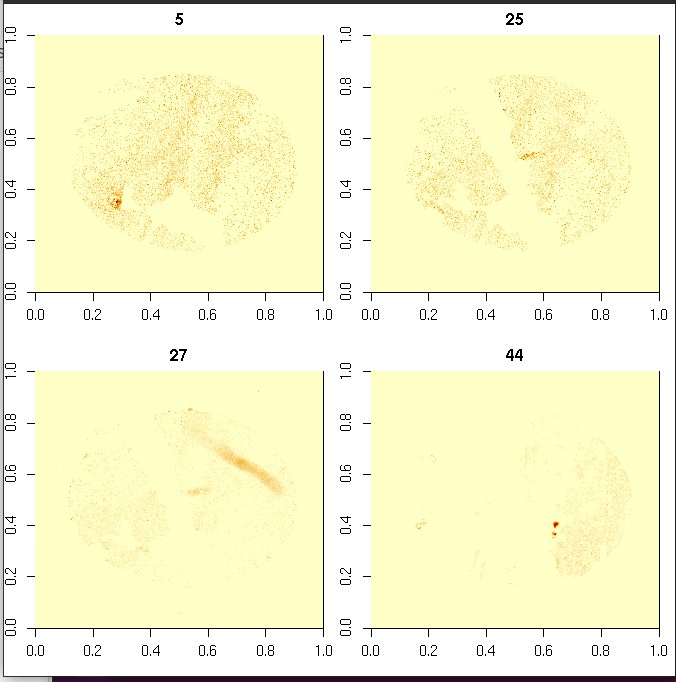

# Introduction

The purpose of this vignette is to briefly describe access to a
tissue microarray dataset lodged in the NSF ACCESS Open Storage
Network (OSN).

# TMA11

## Synapse repository

This [Synapse](https://www.synapse.org) repository contains
data related to the MCMICRO system as described in
a recent [Nature Methods paper](https://doi.org/10.1038/s41592-021-01308-y).

```
https://www.synapse.org/#!Synapse:syn22345749
```

## OSN address and query

```
https://mghp.osn.xsede.org/bir190004-bucket01/index.html#TMA11/zarr/
```

The fifth core in the array can be read using
```
# Ludwig, https://community-bioc.slack.com/archives/C03MKFSS7V2/p1656686685346239
import s3fs
import zarr
import xarray as xr
fs = s3fs.S3FileSystem(anon=True, key="dummy", secret="dummy", 
   client_kwargs={'endpoint_url': "https://mghp.osn.xsede.org/"})
mapper = fs.get_mapper('bir190004-bucket01/TMA11/zarr/5.zarr')
```

In R, the following can be used, once zarr's python library
has been installed in the appropriate python distribution.

```
library(reticulate)
zr = import("zarr")
loc = "https://mghp.osn.xsede.org/bir190004-bucket01/index.html#TMA11/zarr/5.zarr"
c5 = zr.load(loc)
dim(c5)
```

On a decent network connection the load takes under 20 seconds.

The R array c5 serializes to about 1 GB of numeric data (64 x 3007 x 3007).

A small selection of channels from R `image()`:


